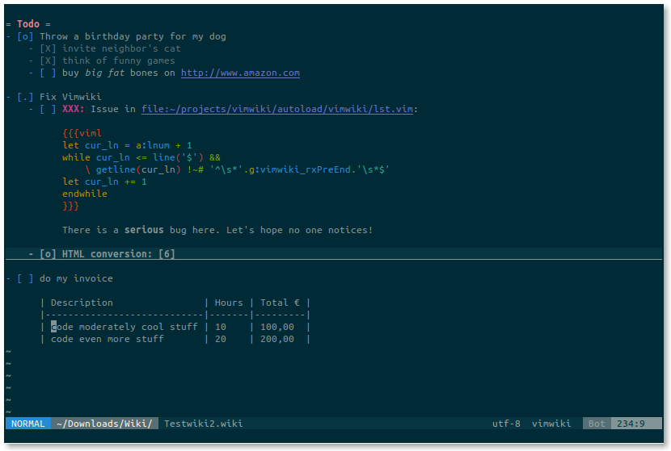

VimWiki —— Vim 个人 Wiki 插件
==============================================================================

[English](README.md)

 *

介绍
------------------------------------------------------------------------------

Vimwiki 是 Vim 中的个人 Wiki —— 一组链接起来的、有独特语法高亮的文本文件。

通过 Vimwiki，你可以:

 * 组织笔记和想法
 * 管理待办事项
 * 编写文档
 * 坚持写日记
 * 将这一切导出成 HTML 网页

马上开始！按下 `<Leader>ww`（通常是 `\ww`）进入作为目录页的 wiki 文件，这个文件默认存放在 `~/vimwiki/index.wiki`。

在该文件中输入以下示例：

    = 我的个人知识库 =
        * 任务列表 -- _昨天_ 就该完成的事！！！
        * Gutenberg 计划 -- 好书给我力量。
        * 草稿 -- 临时记录一些东西。

把光标移到 `任务` 二字上，按 Enter（回车）创建链接。按下后，`任务`二字会变成 `[[任务]]` —— 这是一个 Vimwiki 链接。再次按 Enter 即可进入这个链接（打开新的 wiki 文件）。编辑这个新文件，保存，然后按 Backspace（退格）就能回到目录页。

如果 Vimwiki 链接长度不止一个单词（指的是英文单词），只需在 Visual 模式选择这段文本后按 Enter 即可。用上面的 `Gutenberg 计划` 试试吧。最终结果是这样：

    = 我的个人知识库 =
        * [[任务列表]] -- _昨天_ 就该完成的事！！！
        * [[Gutenberg 计划]] -- 好书给我力量。
        * 草稿 -- 临时记录一些东西。

基本标记
------------------------------------------------------------------------------

    = 一级标题 =
    == 二级标题 ==
    === 三级标题 ===

    *bold* -- 粗体文本
    _italic_ -- 斜体文本
    （应用于句中的汉字文本时，必须在标记前后加空格，例如：一段 *中文* 文本）

    [[wiki link]] -- wiki 链接
    [[wiki link|description]] -- 带有描述文本的 wiki 链接

列表：

    * bullet list item 1（无编号列表）
        - bullet list item 2
        - bullet list item 3
            * bullet list item 4
            * bullet list item 5
    * bullet list item 6
    * bullet list item 7
        - bullet list item 8
        - bullet list item 9

    1. numbered list item 1（有编号列表）
    2. numbered list item 2
        a) numbered list item 3
        b) numbered list item 4

更多格式说明，请阅 `:h vimwiki-syntax`

键位绑定
------------------------------------------------------------------------------

normal 模式:

 * `<Leader>ww` -- 打开默认的 wiki 目录文件
 * `<Leader>wt` -- 在新标签（Tab）中打开 wiki 目录文件
 * `<Leader>ws` -- 在多个 wiki 中选择并打开该 wiki 的目录文件
 * `<Leader>wd` -- 删除当前 wiki 文件
 * `<Leader>wr` -- 重命名当前 wiki 文件
 * `<Enter>` -- 创建或打开 wiki 链接
 * `<Shift-Enter>` -- 先上下分屏再打开 wiki 链接（若非链接则先创建）
 * `<Ctrl-Enter>` -- 先左右分屏再打开 wiki 链接（若非链接则先创建）
 * `<Backspace>` -- 返回之前浏览的 wiki 文件
 * `<Tab>` -- 跳到本文件中下一个 wiki 链接
 * `<Shift-Tab>` -- 跳到本文件中上一个 wiki 链接

更多快捷键说明，请阅 `:h vimwiki-mappings`

命令
------------------------------------------------------------------------------

 * `:Vimwiki2HTML` -- 将当前 wiki 文件转换成 HTML 网页
 * `:VimwikiAll2HTML` -- 把所有 wiki 文件转换成 HTML 网页
 * `:help vimwiki-commands` -- 显示全部命令

安装
==============================================================================

准备工作
------------------------------------------------------------------------------

确保在 `vimrc` 中加入了以下设置：

    set nocompatible
    filetype plugin on
    syntax on

没有这些设置，Vimwiki 将无法正常工作。

通过 [Vim packages](http://vimhelp.appspot.com/repeat.txt.html#packages) 安装（Vim 7.4.1528 后）
------------------------------------------------------------------------------

    git clone https://github.com/vimwiki/vimwiki.git ~/.vim/pack/plugins/start/vimwiki

通过 [Pathogen](http://www.vim.org/scripts/script.php?script_id=2332) 安装
------------------------------------------------------------------------------

    cd ~/.vim
    mkdir bundle
    cd bundle
    git clone https://github.com/vimwiki/vimwiki.git

通过 [Vim-Plug](https://github.com/junegunn/vim-plug) 安装
------------------------------------------------------------------------------

在 `vimrc` 中加入以下插件设置：

    Plug 'vimwiki/vimwiki'

然后运行 `:PlugInstall`。

通过 [Vundle](https://github.com/VundleVim/Vundle.vim) 安装
------------------------------------------------------------------------------

在 `vimrc` 中加入 `Plugin 'vimwiki/vimwiki'`，然后执行：

    vim +PluginInstall +qall

或者下载 [zip 压缩包](https://github.com/vimwiki/vimwiki/archive/master.zip)然后解压到 `~/.vim/bundle/` 目录下。

安装后，启动 Vim 并执行 `:Helptags` 以及 `:help vimwiki`，检查安装是否成功。

获取帮助
==============================================================================

遇到问题？在 Freenode 的 IRC 频道 `#vimwiki`（[网页聊天](https://webchat.freenode.net/?channels=#vimwiki)）提问，或者发送问题到[邮件列表](https://groups.google.com/forum/#!forum/vimwiki)上吧。

----
\* 前面截图中用的是 [solarized 配色方案](https://github.com/altercation/vim-colors-solarized)以及 [lightline](https://github.com/itchyny/lightline.vim) 插件。
