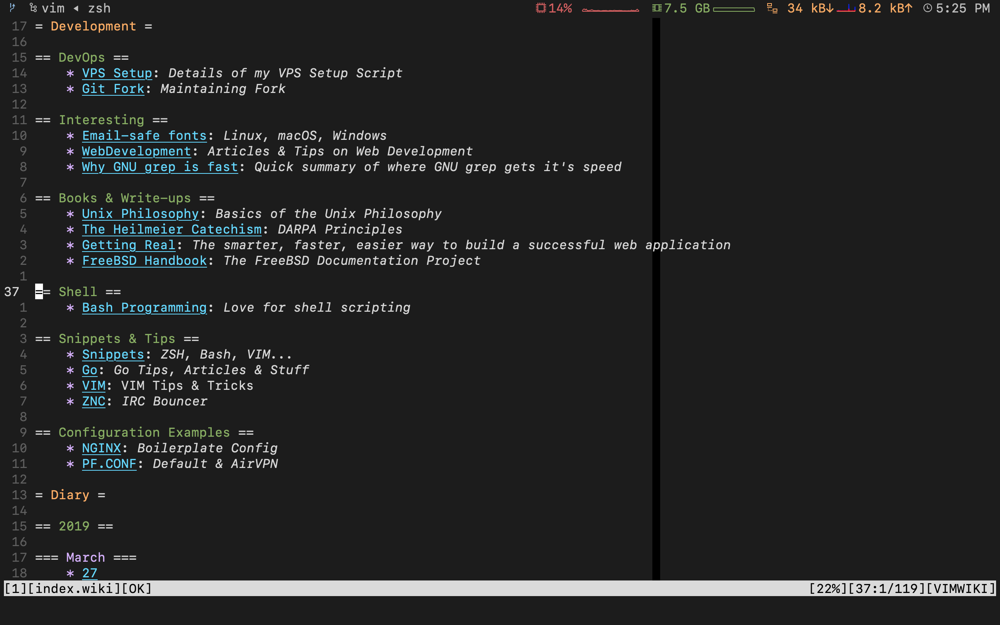
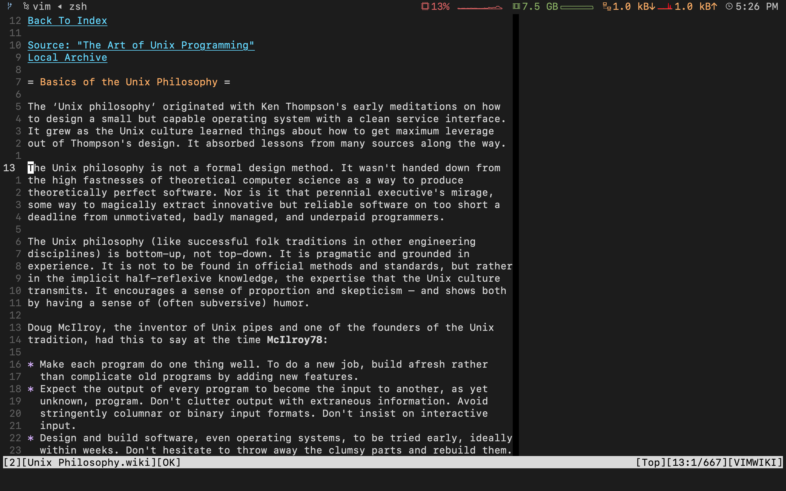

# VimWiki: A Personal Wiki For Vim

[中文](README-cn.md)

- [Intro](#intro)
- [Installation](#installation)
    - [Prerequisites](#prerequisites)
    - [VIM Packages](#installation-using-vim-packages-since-vim-741528)
    - [Pathogen](#installation-using-pathogen)
    - [Vim-Plug](#installation-using-vim-plug)
    - [Vundle](#installation-using-vundle)
- [Basic Markup](#basic-markup)
    - [Lists](#lists)
- [Key Bindings](#key-bindings)
- [Commands](#commands)
- [Changing Wiki Syntax](#changing-wiki-syntax)
- [Getting Help](#getting-help)
- [Helping VimWiki](#helping-vimwiki)
- [Wiki](https://github.com/vimwiki/vimwiki/wiki)
- [License](#license)

## Intro

VimWiki is a personal wiki for Vim -- a number of linked text files that have
their own syntax highlighting.

With VimWiki you can:

 * Organize notes and ideas
 * Manage to-do lists
 * Write documentation
 * Maintain a diary
 * Export everything to HTML

To do a quick start press `<Leader>ww` (this is usually `\ww`) to go to your
index wiki file. By default it is located in `~/vimwiki/index.wiki`.

Feed it with the following example:

```

= My knowledge base =
    * Tasks -- things to be done _yesterday_!!!
    * Project Gutenberg -- good books are power.
    * Scratchpad -- various temporary stuff.

```

Place your cursor on `Tasks` and press Enter to create a link. Once pressed,
`Tasks` will become `[[Tasks]]` -- a VimWiki link. Press Enter again to
open it. Edit the file, save it, and then press Backspace to jump back to your
index.

A VimWiki link can be constructed from more than one word. Just visually
select the words to be linked and press Enter. Try it with `Project Gutenberg`.
The result should look something like:

```

= My knowledge base =
    * [[Tasks]] -- things to be done _yesterday_!!!
    * [[Project Gutenberg]] -- good books are power.
    * Scratchpad -- various temporary stuff.

```

## Screenshots






## Installation

### Prerequisites

Make sure you have these settings in your vimrc file:

```vim

set nocompatible
filetype plugin on
syntax on

```

Without them VimWiki will not work properly.


#### Installation using [Vim packages](http://vimhelp.appspot.com/repeat.txt.html#packages) (since Vim 7.4.1528)

```sh

git clone https://github.com/vimwiki/vimwiki.git ~/.vim/pack/plugins/start/vimwiki

```

#### Installation using [Pathogen](http://www.vim.org/scripts/script.php?script_id=2332)

```sh

cd ~/.vim
mkdir bundle
cd bundle
git clone https://github.com/vimwiki/vimwiki.git

```

#### Installation using [Vim-Plug](https://github.com/junegunn/vim-plug)

Add the following to the plugin-configuration in your vimrc:

```vim

Plug 'vimwiki/vimwiki'

```

Then run `:PlugInstall`.

#### Installation using [Vundle](https://github.com/VundleVim/Vundle.vim)

Add `Plugin 'vimwiki/vimwiki'` to your vimrc file and run

```sh

vim +PluginInstall +qall

```

Or download the [zip
archive](https://github.com/vimwiki/vimwiki/archive/master.zip) and extract it
in `~/.vim/bundle/`

Then launch Vim, run `:Helptags` and then `:help vimwiki` to verify it was
installed.

## Basic Markup

```
= Header1 =
== Header2 ==
=== Header3 ===


*bold* -- bold text
_italic_ -- italic text

[[wiki link]] -- wiki link
[[wiki link|description]] -- wiki link with description
```

### Lists:

```
* bullet list item 1
    - bullet list item 2
    - bullet list item 3
        * bullet list item 4
        * bullet list item 5
* bullet list item 6
* bullet list item 7
    - bullet list item 8
    - bullet list item 9

1. numbered list item 1
2. numbered list item 2
    a) numbered list item 3
    b) numbered list item 4
```

For other syntax elements, see `:h vimwiki-syntax`

## Key bindings

Normal mode:

 * `<Leader>ww` -- Open default wiki index file.
 * `<Leader>wt` -- Open default wiki index file in a new tab.
 * `<Leader>ws` -- Select and open wiki index file.
 * `<Leader>wd` -- Delete wiki file you are in.
 * `<Leader>wr` -- Rename wiki file you are in.
 * `<Enter>` -- Follow/Create wiki link
 * `<Shift-Enter>` -- Split and follow/create wiki link
 * `<Ctrl-Enter>` -- Vertical split and follow/create wiki link
 * `<Backspace>` -- Go back to parent(previous) wiki link
 * `<Tab>` -- Find next wiki link
 * `<Shift-Tab>` -- Find previous wiki link

For more keys, see `:h vimwiki-mappings`

## Commands

 * `:Vimwiki2HTML` -- Convert current wiki link to HTML
 * `:VimwikiAll2HTML` -- Convert all your wiki links to HTML
 * `:help vimwiki-commands` -- list all commands
 * `:help vimwiki` -- General vimwiki help docs

## Changing Wiki Syntax

VimWiki currently ships with 3 syntaxes: VimWiki (default), Markdown
(markdown), and MediaWiki (media)

If you would prefer to use either Markdown or MediaWiki syntaxes, set the
following option in your .vimrc:

```vim

let g:vimwiki_list = [{'path': '~/vimwiki/',
                      \ 'syntax': 'markdown', 'ext': '.md'}]

```

## Getting help

**Have a question?**  
Visit the IRC channel [`#vimwiki`](https://webchat.freenode.net/?channels=#vimwiki) on Freenode ([webchat](https://webchat.freenode.net/?channels=#vimwiki), also synced to Matrix/Riot: `#vimwiki:matrix.org`) or post to the [mailing list](https://groups.google.com/forum/#!forum/vimwiki).

## Helping VimWiki

VimWiki has a lot of users but only very few recurring developers or people
helping the community. Your help is therefore appreciated. Everyone can help!
See [#625](https://github.com/vimwiki/vimwiki/issues/625) for information on
how you can help.

## License

MIT License

Copyright (c) 2008-2010 Maxim Kim
              2013-2017 Daniel Schemala

Permission is hereby granted, free of charge, to any person obtaining a copy
of this software and associated documentation files (the "Software"), to deal
in the Software without restriction, including without limitation the rights
to use, copy, modify, merge, publish, distribute, sublicense, and/or sell
copies of the Software, and to permit persons to whom the Software is
furnished to do so, subject to the following conditions:

The above copyright notice and this permission notice shall be included in all
copies or substantial portions of the Software.

THE SOFTWARE IS PROVIDED "AS IS", WITHOUT WARRANTY OF ANY KIND, EXPRESS OR
IMPLIED, INCLUDING BUT NOT LIMITED TO THE WARRANTIES OF MERCHANTABILITY,
FITNESS FOR A PARTICULAR PURPOSE AND NONINFRINGEMENT. IN NO EVENT SHALL THE
AUTHORS OR COPYRIGHT HOLDERS BE LIABLE FOR ANY CLAIM, DAMAGES OR OTHER
LIABILITY, WHETHER IN AN ACTION OF CONTRACT, TORT OR OTHERWISE, ARISING FROM,
OUT OF OR IN CONNECTION WITH THE SOFTWARE OR THE USE OR OTHER DEALINGS IN THE
SOFTWARE.
