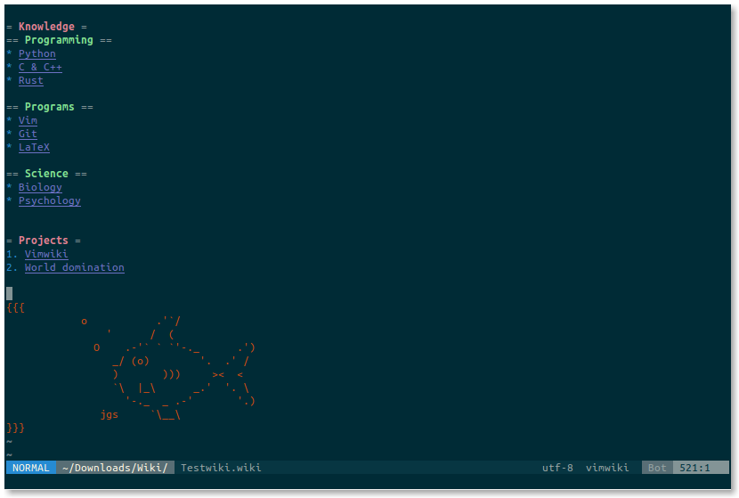

A Personal Wiki For Vim
==============================================================================

Intro
------------------------------------------------------------------------------

Vimwiki is a personal wiki for Vim -- a number of linked text files that have
their own syntax highlighting.

With Vimwiki you can:

 * organize notes and ideas
 * manage todo-lists
 * write documentation
 * maintain a diary
 * export everything to HTML

To do a quick start press `<Leader>ww` (this is usually `\ww`) to go to your index
wiki file.  By default it is located in `~/vimwiki/index.wiki`.

Feed it with the following example:

    = My knowledge base =
        * Tasks -- things to be done _yesterday_!!!
        * Project Gutenberg -- good books are power.
        * Scratchpad -- various temporary stuff.

Place your cursor on `Tasks` and press Enter to create a link.  Once pressed,
`Tasks` will become `[[Tasks]]` -- a Vimwiki link.  Press Enter again to
open it.  Edit the file, save it, and then press Backspace to jump back to your
index.

A Vimwiki link can be constructed from more than one word.  Just visually
select the words to be linked and press Enter.  Try it with `Project Gutenberg`.
The result should look something like:

    = My knowledge base =
        * [[Tasks]] -- things to be done _yesterday_!!!
        * [[Project Gutenberg]] -- good books are power.
        * Scratchpad -- various temporary stuff.

Basic Markup
------------------------------------------------------------------------------

    = Header1 =
    == Header2 ==
    === Header3 ===

    *bold* -- bold text
    _italic_ -- italic text

    [[wiki link]] -- wiki link
    [[wiki link|description]] -- wiki link with description

Lists:

    * bullet list item 1
        - bullet list item 2
        - bullet list item 3
            * bullet list item 4
            * bullet list item 5
    * bullet list item 6
    * bullet list item 7
        - bullet list item 8
        - bullet list item 9

    1. numbered list item 1
    2. numbered list item 2
        a) numbered list item 3
        b) numbered list item 4

For other syntax elements, see `:h vimwiki-syntax`

Key bindings
------------------------------------------------------------------------------

normal mode:

 * `<Leader>ww` -- Open default wiki index file.
 * `<Leader>wt` -- Open default wiki index file in a new tab.
 * `<Leader>ws` -- Select and open wiki index file.
 * `<Leader>wd` -- Delete wiki file you are in.
 * `<Leader>wr` -- Rename wiki file you are in.
 * `<Enter>` -- Follow/Create wiki link
 * `<Shift-Enter>` -- Split and follow/create wiki link
 * `<Ctrl-Enter>` -- Vertical split and follow/create wiki link
 * `<Backspace>` -- Go back to parent(previous) wiki link
 * `<Tab>` -- Find next wiki link
 * `<Shift-Tab>` -- Find previous wiki link

For more keys, see `:h vimwiki-mappings`

Commands
------------------------------------------------------------------------------

 * `:Vimwiki2HTML` -- Convert current wiki link to HTML
 * `:VimwikiAll2HTML` -- Convert all your wiki links to HTML
 * `:help vimwiki-commands` -- list all commands

Installation
==============================================================================

Prerequisites
------------------------------------------------------------------------------

Make sure you have these settings in your vimrc file:

    set nocompatible
    filetype plugin on
    syntax on

Without them Vimwiki will not work properly.

Installation using [Pathogen](http://www.vim.org/scripts/script.php?script_id=2332)
------------------------------------------------------------------------------

    cd ~/.vim
    mkdir bundle
    cd bundle
    git clone https://github.com/vimwiki/vimwiki.git

Or download the [zip archive](https://github.com/vimwiki/vimwiki/archive/master.zip) and extract it in `~/.vim/bundle/`

Then launch Vim, run `:Helptags` and then `:help vimwiki` to verify it was installed.
